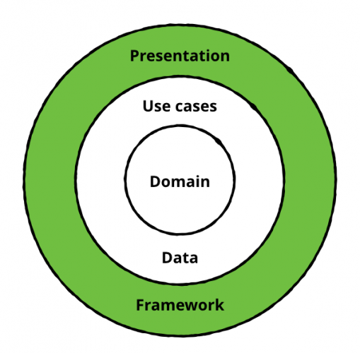

## NAB Banking Products

A simple demo project to display the products offered by National Australian Bank. The code is based on MVVM clean architecture.
Below are the screenshots of the application.

**Application Visuals**

### App Features
User can see the list of products offered by NAB. Also they can view the more details like eligibility, rates, charges and features of the product they have selected. 

**Personal Banking**

**Modules**

1. List Products
2. Display Product Detail

**Architecture Layer Diagram**

**Data and Domain** - Core layers less prone to changes. As these two layers are abstract can be plugged to other platforms.
    
    1. Domain - Models 
    2. Data - Abstract data source
    
**Framework** - It provides the implementation for the data layer and interacts with the platform (Android SDK).   

    1. Endpoints specification
    2. Data source implementation
    3. View Models 
    
**Presentation** - This layer more prone to changes so it has concrete implementation of UI. It's only task is display the data in UI.

    1. Activities, Fragments, Views etc

### App spec

* Kotlin
* Java 
* MVVM Architecture
* Android Architecture Components (LiveData, Lifecycle, ViewModel, Room Persistence Library, ConstraintLayout)
* RxJava2.
* Navigation component
* Hilt for dependency injection.
* Retrofit 2 for API integration.
* Gson for serialisation.
* Glide for image loading.

    
    
